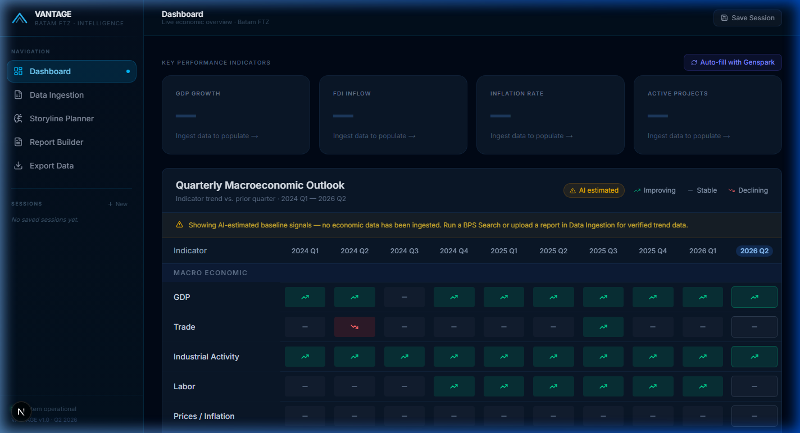
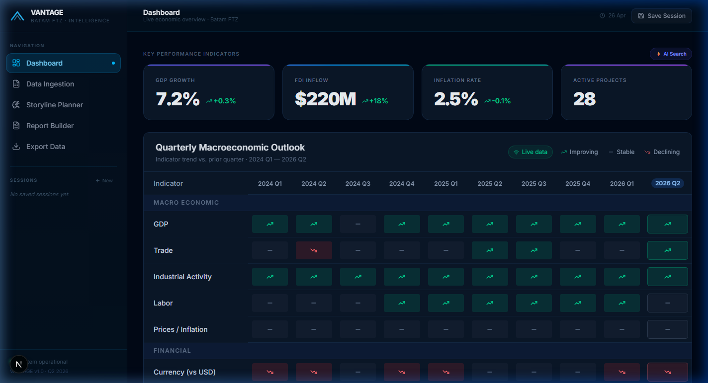
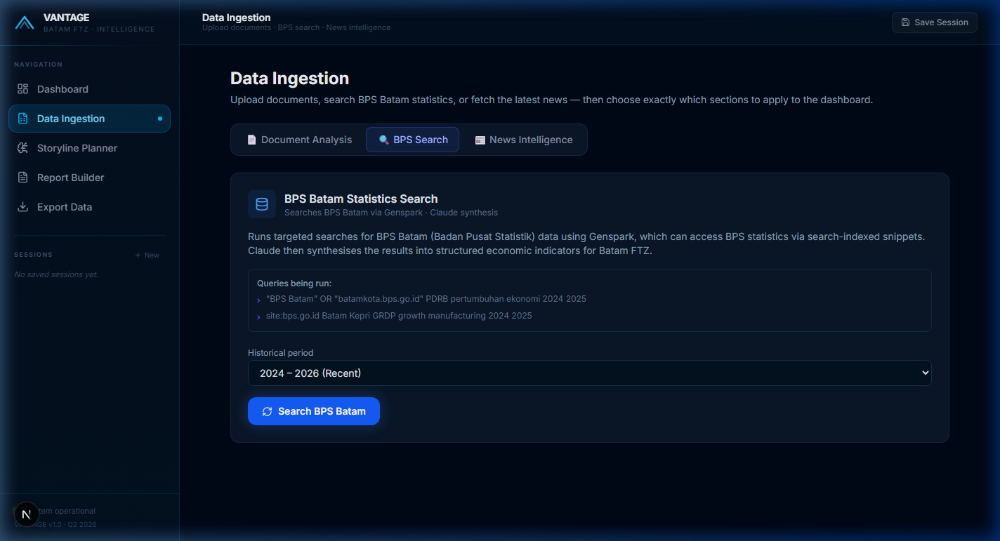
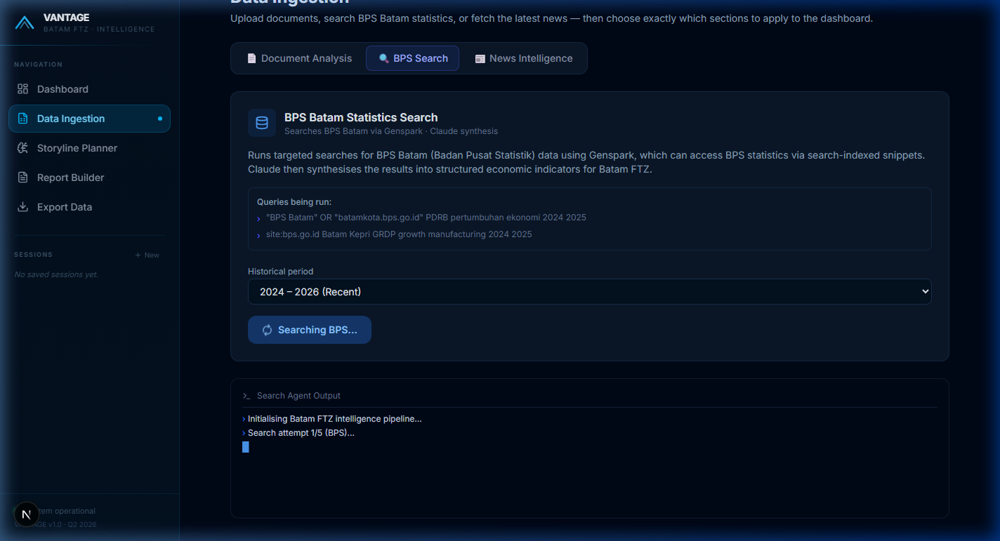
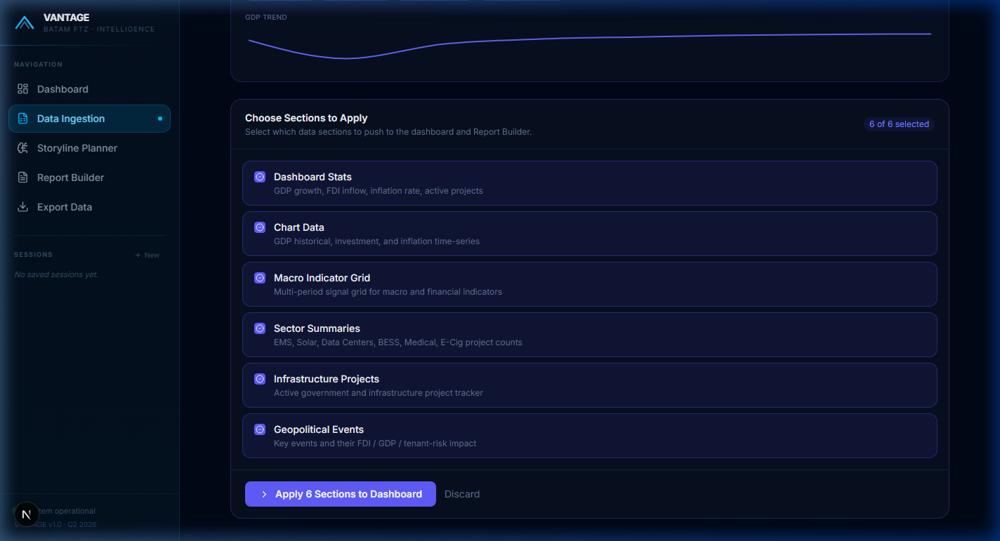
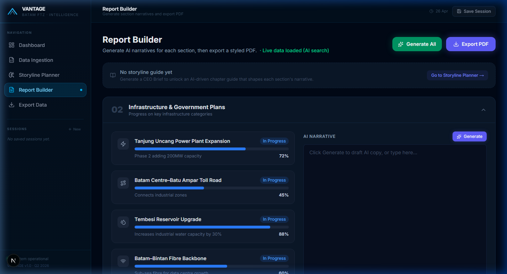

# VANTAGE — Batam FTZ Economic Intelligence Platform

> AI-powered quarterly economic reporting for Batam Free Trade Zone tenants.  
> From raw data to boardroom-ready insights in minutes — no manual charting, no copy-paste.

---

## Demo

> Full end-to-end walkthrough: Genspark BPS search → live logs → dashboard population → AI narrative generation → PDF export.

https://github.com/JoozKelly/q2-automation-webapp/releases/download/v1.0.0-demo/demo.mp4

---

## Screenshots

| Dashboard (empty state) | Dashboard (live data) |
|---|---|
|  |  |

| Data Ingestion — BPS Search | Live Genspark CLI Logs |
|---|---|
|  |  |

| Section Selector (after search) | Report Builder |
|---|---|
|  |  |

---

## What it does

```
Raw Data  ──►  AI Ingestion  ──►  Dashboard  ──►  Storyline  ──►  Report + PDF
(BPS, PDFs,     (Genspark +       (charts,          Planner        (AI-written
 news, XLSX)     Claude AI)        KPIs, signals)                   narratives)
```

---

## Features

### Data Ingestion

Three modes, all streaming live progress to a terminal pane:

| Mode | What it does |
|---|---|
| **BPS Search** | Queries Genspark.ai for live BPS/BP Batam statistics. Claude synthesises search results into structured economic indicators. Retries across up to 5 query strategies until data is found. |
| **Document Upload** | Drag-and-drop CSV, Excel, PDF, or image files. Claude analyses them with multimodal understanding and extracts GDP, FDI, inflation, sector, and infrastructure data. |
| **News Feed** | Scrapes Reuters, Jakarta Post, Straits Times, Business Times for Batam FTZ headlines. Each article gets a category, relevance score, AI summary, Unsplash thumbnail image, and a clickable "View source" link. |

- **Historical period selector** — choose data range: 2020–2026, 2022–2026, 2024–2026, or 2025–2026 before fetching
- **Section selector** — preview what was found and choose exactly which sections to push to the dashboard (no blind overwrites)
- **Data confidence** — green "Live data" badge when Genspark returns real results; amber "AI estimated" badge + warning banner when Claude generates from knowledge only

### Dashboard

- KPI row: GDP growth %, FDI inflow ($M), inflation rate, active project count
- 10-quarter macroeconomic outlook grid — improving / stable / declining per indicator, 2024 Q1 → 2026 Q2
- GDP vs target line chart, investment inflows stacked area chart, monthly inflation bar chart
- Infrastructure tracker with animated progress bars
- Geopolitical events with FDI / GDP / tenant-risk impact tags and "View source" links
- News feed with hero images, Unsplash thumbnails, and "View source" links

### Storyline Planner (CEO Brief)

- Upload previous quarter report files + paste Q1 highlights as baseline context
- Claude generates a structured Q2 2026 narrative arc: chapter titles, angles, key messages, talking points
- Q1 context and the generated brief persist across navigation

### Report Builder

- AI-assisted section drafting: Macro, Infrastructure, Geopolitics, Sectors, Outlook
- **Generate All** — runs all sections sequentially with live progress
- **Storyline ready banner** — appears when a CEO brief exists but no sections drafted yet
- All narratives persist to Zustand across navigation
- **Export PDF** — react-to-pdf generates a styled report with all charts embedded

### Export Data

- Multi-sheet XLSX workbook (SheetJS): Dashboard Stats, GDP, Investment, Inflation, Infrastructure, Geo Events, Sector Summaries, News Items
- Per-table 10-row preview with individual sheet download
- "Download All" exports the full workbook as `VANTAGE_Batam_FTZ_Data.xlsx`

### Sessions + UI Persistence

- Named sessions saved to localStorage via Zustand persist — load any session from the sidebar
- Active tab, search query, historical period, and CEO brief text all persist across page navigation
- "New Session" confirmation modal — clears workspace without affecting saved sessions

---

## Tech Stack

| Layer | Technology |
|---|---|
| Framework | Next.js 15 · App Router · Turbopack |
| Language | TypeScript (strict) |
| Styling | Tailwind CSS v4 + CSS design tokens (sky/cyan palette) |
| Charts | Recharts v3 — fixed pixel dimensions for PDF rendering |
| State | Zustand v5 + `persist` middleware (3 stores) |
| AI | Anthropic `claude-sonnet-4-6` via `@anthropic-ai/sdk` |
| Web search | Genspark CLI (`npx @genspark/cli search <query> --output json`) |
| PDF export | `react-to-pdf` (`usePDF`) |
| Excel export | SheetJS (`xlsx`) |
| News images | Unsplash Source API (no auth required) |

---

## Architecture

```
┌──────────────────────────────────────────────────────────────────┐
│                        Next.js App Router                        │
├──────────────┬──────────────┬──────────────┬────────────────────┤
│   Dashboard  │  Ingestion   │  Storyline   │  Report Builder    │
│   /          │  /ingestion  │  /ceo-brief  │  /report-builder   │
└──────────────┴──────────────┴──────────────┴────────────────────┘
        │                           │
        ▼                           ▼
┌──────────────────┐      ┌──────────────────────────────────┐
│  Zustand Stores  │      │  API Routes (streaming text/plain)│
│  reportStore     │      │  /api/ingest    ─┐               │
│  sessionStore    │      │  /api/news       ├─ Genspark CLI │
│  uiStateStore    │      │  /api/ceo-brief  │               │
│  useDataStore    │      │  /api/analyze-files               │
└──────────────────┘      └──────────────────────────────────┘
                                      │
             ┌────────────────────────┴───────────────────────┐
             ▼                                                 ▼
  ┌────────────────────┐                          ┌───────────────────────┐
  │   Genspark CLI     │                          │   Anthropic Claude    │
  │   (web scraper)    │─── raw text (≤5000 ch) ─▶│   claude-sonnet-4-6   │
  └────────────────────┘                          └───────────────────────┘
                                                            │
                                               brace-counting JSON extractor
                                               + repair (trailing commas, etc.)
                                                            │
                                               Zustand store update
                                                            │
                                               React re-render
```

### Streaming Protocol

```
[LOG]     progress update shown in terminal pane
[WARN]    non-fatal warning (e.g. no web data found — using AI estimate)
[PAYLOAD] the main JSON payload (parsed by client)
[ERROR]   failure message
[DONE]    stream end sentinel
```

---

## Getting Started

### Prerequisites

- Node.js 20+
- Anthropic API key

### Install

```bash
git clone https://github.com/JoozKelly/q2-automation-webapp
cd q2-automation-webapp
npm install
```

### Environment

```bash
cp .env.local.example .env.local
# Edit .env.local and set ANTHROPIC_API_KEY
```

Or create `.env.local` manually:

```env
ANTHROPIC_API_KEY=sk-ant-...
```

### Run

```bash
npm run dev      # development (Turbopack, hot reload)
npm run build    # production build
npm run start    # serve production build
npx tsc --noEmit # type-check without building
```

---

## Deployment Guide

### ⚠️ Critical: Genspark CLI on Serverless Platforms

The API routes use `child_process.spawn('npx', ['@genspark/cli', ...])`. **This will not work on Vercel or any other serverless/edge platform** — no persistent shell, no npm binaries in the sandbox.

Choose the option that fits your workflow:

---

### Option 1 — VPS + PM2 ✅ Recommended

Full Node.js process, Genspark CLI works natively.

**Providers:** Hetzner CX22 (~€4/mo), DigitalOcean Basic (~$6/mo), or any Ubuntu 22.04 VPS.

```bash
# On your server
npm ci
npm run build
npm install -g pm2
pm2 start "npm run start" --name vantage
pm2 save && pm2 startup
```

Nginx reverse proxy (port 80 → 3000):

```nginx
server {
    listen 80;
    server_name your-domain.com;
    location / {
        proxy_pass http://localhost:3000;
        proxy_http_version 1.1;
        proxy_set_header Upgrade $http_upgrade;
        proxy_set_header Connection 'upgrade';
        proxy_set_header Host $host;
        proxy_cache_bypass $http_upgrade;
    }
}
```

Add `ANTHROPIC_API_KEY` to `/etc/environment` or use a `.env.local` file on the server.

---

### Option 2 — Railway ✅ Easiest managed option

Railway supports full Node.js processes — Genspark CLI works.

1. Push to GitHub
2. New Railway project → "Deploy from GitHub repo"
3. Add env var `ANTHROPIC_API_KEY` in Railway dashboard
4. Railway auto-detects Next.js and runs `npm run build && npm run start`

Free tier available; ~$5/mo for always-on service.

---

### Option 3 — Docker (deploy anywhere)

Add to `next.config.ts`:
```ts
output: 'standalone'
```

`Dockerfile`:
```dockerfile
FROM node:22-alpine AS builder
WORKDIR /app
COPY package*.json ./
RUN npm ci
COPY . .
RUN npm run build

FROM node:22-alpine AS runner
WORKDIR /app
ENV NODE_ENV=production
COPY --from=builder /app/.next/standalone ./
COPY --from=builder /app/.next/static ./.next/static
COPY --from=builder /app/public ./public
EXPOSE 3000
CMD ["node", "server.js"]
```

```bash
docker build -t vantage .
docker run -p 3000:3000 -e ANTHROPIC_API_KEY=sk-ant-... vantage
```

---

### Option 4 — Vercel (requires one code change)

Replace all `spawn('npx', ['@genspark/cli', ...])` calls with Anthropic's native `web_search` tool:

```ts
const message = await client.messages.create({
  model: 'claude-sonnet-4-6',
  max_tokens: 4000,
  tools: [{ type: 'web_search_20250305', name: 'web_search', max_uses: 5 }],
  messages: [{ role: 'user', content: buildPrompt(query, '') }],
  betas: ['web-search-2025-03-05'],
});
```

This removes the Genspark dependency entirely. Search quality is comparable. Then deploy normally with `vercel --prod`.

---

## Suggested Improvements

These are not yet implemented but are high-value next steps:

### Quick wins (1–2 days each)

| Improvement | Why |
|---|---|
| Replace Genspark CLI with Claude `web_search` tool | Unlocks Vercel deployment; removes fragile CLI dependency |
| `unstable_cache` on API routes (5-min TTL) | Avoid re-fetching identical queries; faster repeat loads |
| React Error Boundaries per dashboard section | One broken chart won't crash the whole page |
| Upstash rate limiting middleware | Prevent API key exhaustion if deployed publicly |

### Medium-term (1 week each)

| Improvement | Why |
|---|---|
| Split large page components into `feature/` folders | Dashboard and ingestion pages are 800–1000 lines — break into co-located hooks + sub-components |
| PostgreSQL session storage (Neon) | Currently localStorage — breaks across browsers and devices |
| Clerk or NextAuth authentication | Multi-user access with per-user session isolation |
| Scheduled auto-refresh | Cron-triggered data fetch at quarter end |

### Long-term

| Improvement | Why |
|---|---|
| MCP server for Batam data | Expose indicators as a Model Context Protocol server for Claude Desktop |
| Multiple PDF templates | Executive summary, full report, tenant brief |
| Data versioning | Track how indicators change across consecutive fetches |

---

## Project Structure

```
src/
├── app/
│   ├── page.tsx                     # Dashboard
│   ├── ingestion/page.tsx           # Data Ingestion (BPS · Upload · News)
│   ├── ceo-brief/page.tsx           # Storyline Planner
│   ├── report-builder/page.tsx      # Report Builder + PDF export
│   ├── export/page.tsx              # Excel export
│   ├── globals.css                  # Design tokens + animations
│   └── api/
│       ├── ingest/route.ts          # Genspark + Claude data synthesis
│       ├── news/route.ts            # News fetch + Unsplash image URLs
│       ├── ceo-brief/route.ts       # Storyline generation
│       └── analyze-files/route.ts   # Document analysis
├── components/
│   ├── charts/MacroIndicatorGrid.tsx
│   ├── pdf/ReportPDFContent.tsx     # PDF layout with all charts
│   └── ui/
│       ├── Sidebar.tsx              # Nav + sessions panel
│       └── Header.tsx               # Page title + save session
├── store/
│   ├── reportStore.ts               # Central dashboard data + narratives
│   ├── sessionStore.ts              # Named session save/load
│   └── uiStateStore.ts              # UI state persistence (tabs, queries)
├── context/store.ts                 # Raw chart time-series data
└── types/report.ts                  # All TypeScript interfaces
```

---

## Brand

**VANTAGE** — deep-space dark theme, sky/cyan primary accent. Bloomberg Terminal aesthetic.

| Token | Value | Usage |
|---|---|---|
| `--bg` | `#010b18` | Page background |
| `--surface-2` | `#071a2e` | Card surfaces |
| `--accent` | `#0ea5e9` | Buttons, active nav, links |
| `--text-1` | `#f0f6ff` | Primary text |
| `--text-2` | `#7a8fa5` | Secondary text |
| `--border` | `rgba(14,165,233,0.18)` | Card borders |

---

## Key Design Decisions

**JSON parsing robustness** — Claude sometimes outputs JSON with trailing commas, unquoted keys, or markdown code fences. A brace-counting extractor finds all `{...}` candidates and selects the largest (avoiding inline examples Claude may write before the real payload), then a repair pass strips comments, fixes trailing commas, and quotes bare keys.

**Sequential scraping with retry** — If Genspark returns nothing on the first query, the route automatically tries the next in a list of up to 5 strategies. Claude is used as a last resort (with an "AI estimated" confidence flag).

**Streaming UX** — All API routes stream line-prefixed text instead of returning JSON directly. This lets the UI show a live terminal pane with progress logs while the data loads, rather than a blank spinner.

**Section selector** — Rather than blindly overwriting the dashboard, users see a preview of what was found and choose which sections to apply. Prevents accidental overwrites when experimenting with different sources.

---

## Environment Variables

| Variable | Required | Description |
|---|---|---|
| `ANTHROPIC_API_KEY` | Yes | Anthropic API key (`sk-ant-...`) |

---

## License

Private — internal tool for Batam FTZ reporting workflow.
